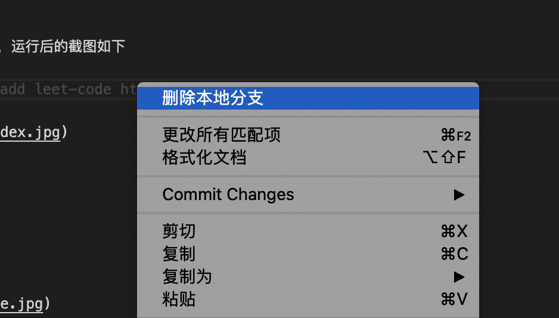
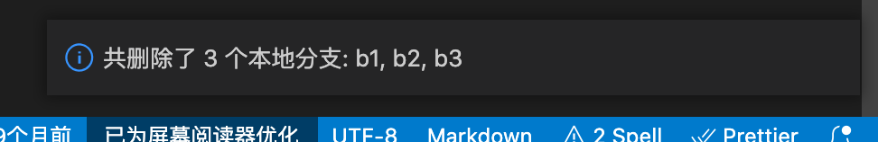
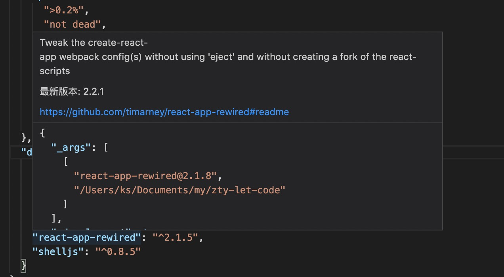
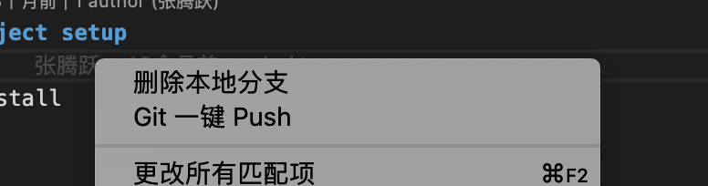
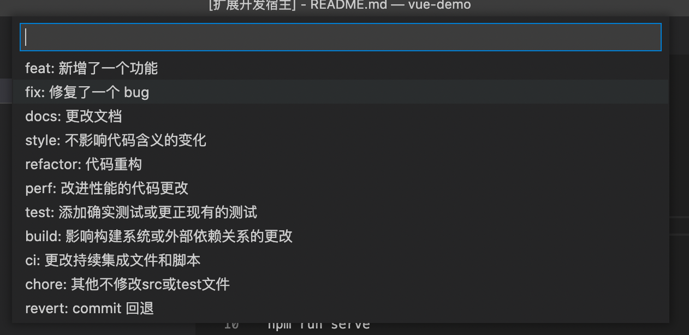
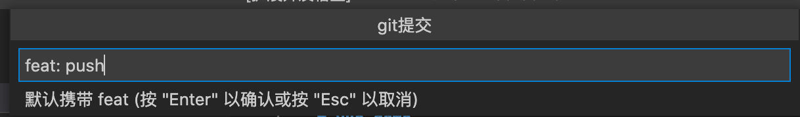
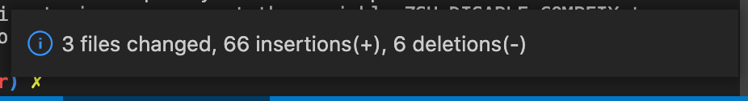
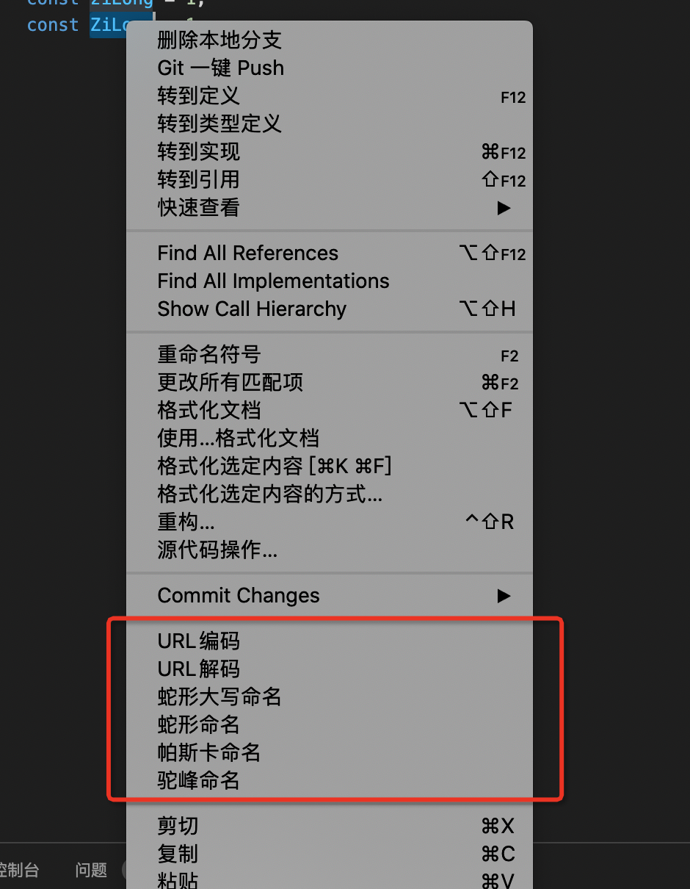
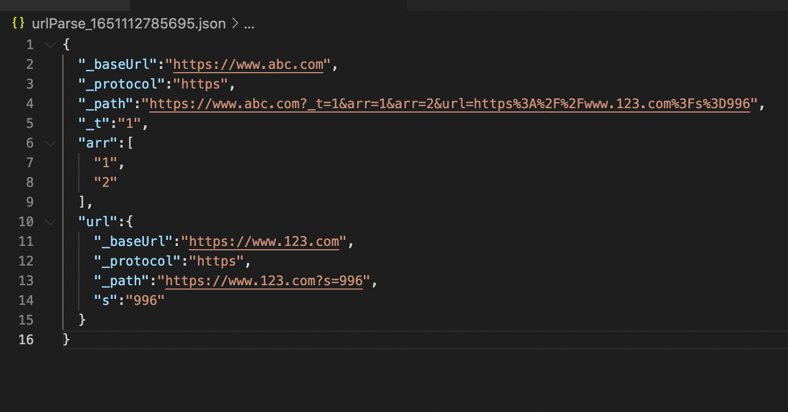

# ty-vs-helper

vscode 插件

 

## Features

 

- 支持一键删除本地分支

操作，文件右键点击选择删除本地分支即可

 

 

 

- 查看,跳转 package.json 中的依赖

操作：cmd + 鼠标悬浮显示，点击跳转

 

 

- git 一键 push

操作：cmd + 鼠标悬浮显示，点击跳转

 

 

选择 commit type (可配置，默认不启用)

 

输入 msg

 

显示结果

 

- 转换功能
  - URL 解码
  - URL 编码
  - 蛇形大写命名
  - 蛇形命名
  - 帕斯卡命名
  - 驼峰命名

1. 选择变量，url
2. 右键点击

 

 

- url 解析功能

选中相应的 url 后右键点击选择`URL解析`

例子：对应 url https://www.abc.com?_t=1&arr=1&arr=2&url=https%3A%2F%2Fwww.123.com%3Fs%3D996，解析结果如下

 

 

 

## Requirements

If you have any requirements or dependencies, add a section describing those and how to install and configure them.

## Extension Settings

Include if your extension adds any VS Code settings through the `contributes.configuration` extension point.

For example:

This extension contributes the following settings:

- `myExtension.enable`: enable/disable this extension
- `myExtension.thing`: set to `blah` to do something

## Known Issues

Calling out known issues can help limit users opening duplicate issues against your extension.

## Release Notes

Users appreciate release notes as you update your extension.

### 1.0.0

Initial release of ...

### 1.0.1

Fixed issue #.

### 1.1.0

Added features X, Y, and Z.

---

## Working with Markdown

**Note:** You can author your README using Visual Studio Code. Here are some useful editor keyboard shortcuts:

- Split the editor (`Cmd+\` on macOS or `Ctrl+\` on Windows and Linux)
- Toggle preview (`Shift+CMD+V` on macOS or `Shift+Ctrl+V` on Windows and Linux)
- Press `Ctrl+Space` (Windows, Linux) or `Cmd+Space` (macOS) to see a list of Markdown snippets

### For more information

- [Visual Studio Code's Markdown Support](http://code.visualstudio.com/docs/languages/markdown)
- [Markdown Syntax Reference](https://help.github.com/articles/markdown-basics/)

**Enjoy!**
